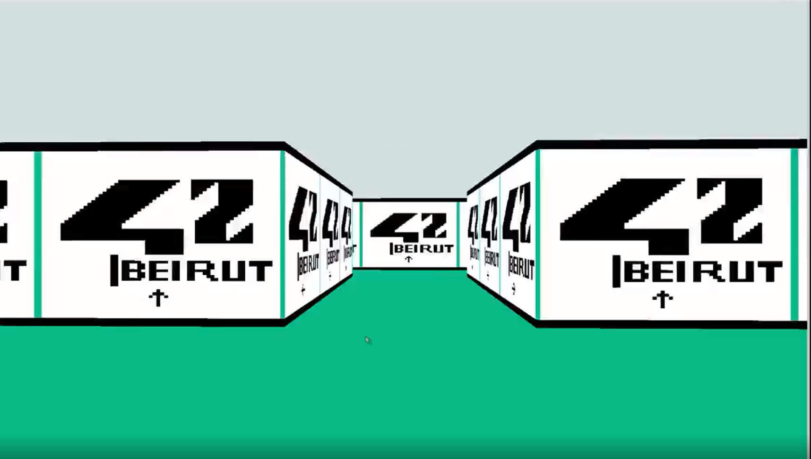

# 🧩 3DReality Game




## 🧾 Project Overview

`3DReality Game` is a 3D raycasting game engine built in C. The project simulates a basic 3D environment where the player can navigate through a map made of walls and open spaces, similar to the classic 2D game engine used in older FPS games like *Wolfenstein 3D*. The core of the engine uses **raycasting** to render 3D views of the environment.

This project focuses on mastering **graphics rendering**, **game loop mechanics**, and **raycasting algorithms**, while leveraging low-level C programming techniques for performance.

## 💡 Key Concepts

- **Raycasting**: How rays are cast to calculate intersections with walls and render 3D perspectives.
- **Texture Mapping**: Applying textures to walls and floors in the environment.
- **Game Loop**: Managing continuous rendering and input processing in real-time.
- **Math in 3D**: Using trigonometry to compute angles and distances for rendering.
- **Memory Management**: Efficiently using memory for game state and textures.

## 🛠️ Technologies Used

- Language: C
- Library: MiniLibX (42’s custom lightweight graphics library)

## DDA algorithm

The DDA-line algorithm rasterizes the line segment between two specified points using calculations in floating-point numbers or integers.
Let the segment be defined by the real coordinates of the ends (x1, y1), (x2, y2). The raster (integer) coordinates of the endpoints are rounded values of the source coordinates: x_start =round (X1), y_start = round(Y1), x_end = round(x2), and y_end = round(Y2).

A larger absolute number, (x_end - x_start) or (y_end - y_start), increased by 1 L of the rasterization cycle.

At the beginning of the cycle the auxiliary real variables x and g are assigned the initial coordinates of the beginning of the segment: x = x1, y = y1. at each step of the loop, these real variables get increments (x_end - x_start) / L, (y_end - y_start) / L. The raster coordinates produced at each step are the result of rounding the corresponding real values x and y.

The use of calculations with real numbers and only a single use of rounding to finally obtain the value of the raster coordinate results in high accuracy and low performance of the algorithm.

## 🚀 How It Works

1. The program loads a **2D map** file (`.cub`) to represent the game environment.
2. **Raycasting** is used to simulate a 3D perspective by projecting rays into the environment to determine wall distances.
3. The player can move and look around using keyboard and mouse inputs.
4. The game continuously updates and renders the environment, handling player actions, textures, and movement.

## 🧪 Example Run

```bash
./cub3d map.cub


Where map.cub is a file containing the map layout. You can navigate through the environment using W, A, S, D keys and look around using the mouse.
🔄 Map Format

The .cub file contains:

    Player position and orientation

    Walls and open spaces

    Textures for walls, floors, and ceilings

    Game settings (screen size, colors, etc.)

🎮 Controls

    W: Move forward

    S: Move backward

    A: Move left

    D: Move right

    Mouse: Look around
